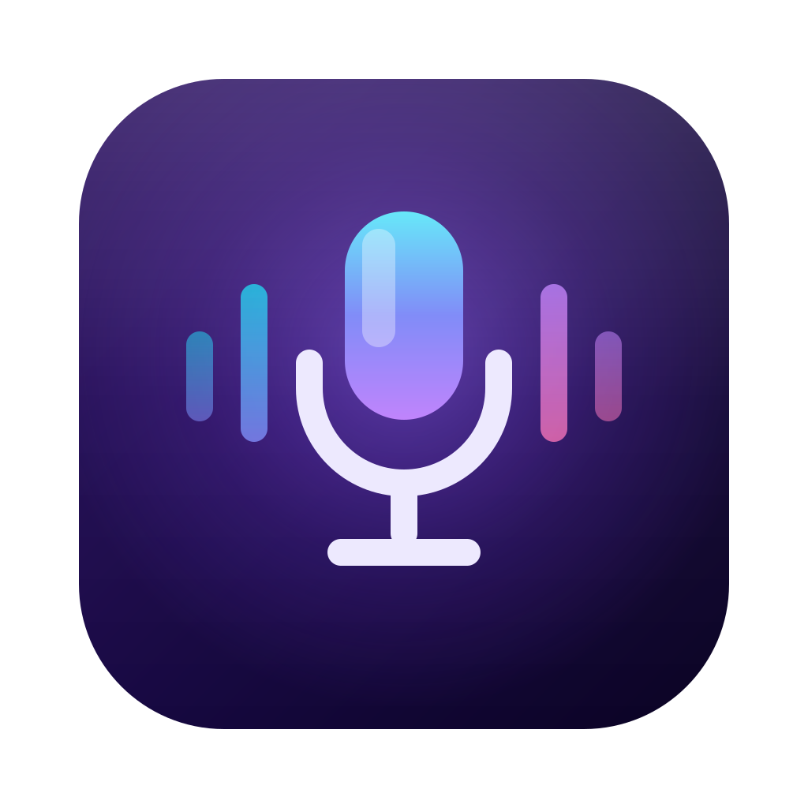

<div align="center">


# Dikta

**Local voice dictation & lecture capture for macOS — Hebrew & English, no cloud required**

Hold a key, speak, release — the text appears where your cursor is.
Or record a lecture off your screen and get a Markdown document of every slide with what was said over it.
</div>

---

## Contents

- [What it does](#what-it-does) · [Features](#features) · [Requirements](#requirements) · [Installation](#installation)
- [Dictation](#dictation) · [Screen recording](#screen-recording-lectures-meetings) · [Claude summaries](#claude-summaries)
- [CLI reference](#cli-reference) · [Development](#development) · [Structure](#structure)

## What it does

Hold a keyboard shortcut (default: **Right Option**), speak, release:

- If the cursor is in a text field — the transcript is **typed right in**, and your clipboard is restored afterwards
- If not — the transcript is **copied to the clipboard** and a notification appears

Everything runs on your machine. No audio and no text ever leaves it. The only feature that talks to the network is the optional Claude summary, and only when you turn it on.

## Features

- 🎙️ **Press-and-hold** — no clicks, no windows; just talk
- 🌍 **Automatic language routing** — Hebrew goes to the [ivrit.ai](https://huggingface.co/ivrit-ai) fine-tune when it is downloaded, everything else to Whisper large-v3-turbo
- ⌨️ **Custom shortcut** — a single key or a combo (⌃⌥Space etc.), captured from the menu
- 🧠 **Memory-aware** — models unload after 5 idle minutes and reload in under a second
- ⚡ **Fast** — Metal on Apple Silicon; ~0.25s for 4s of speech on an M5 Pro
- 🖥️ **Screen recording → Markdown** — records a display + system audio, detects slide changes live by perceptual hashing, transcribes with timestamps, and writes `index.md`: every slide's screenshot with what was said over it. **No video file is ever written**
- 🔢 **Numbered screens** — opening the display picker draws a large numbered card on every physical monitor, so picking the right one is never guesswork
- 🤖 **Optional Claude summary** — Claude reads the slide images plus the transcript and writes a unified Hebrew `summary.md`

## Requirements

- macOS 14+ on Apple Silicon
- Xcode Command Line Tools only (`xcode-select --install`) — **no Xcode needed**
- ~600MB of disk for the base model, +1.6GB for the optional Hebrew model
- *Only for the Claude summary:* either the [`claude` CLI](https://claude.com/claude-code) installed and logged in (the default engine), or an Anthropic API key

## Installation

```bash
git clone https://github.com/yahelhai/Dikta.git
cd Dikta
make fetch     # downloads the whisper.cpp XCFramework (one-time)
make models    # downloads the base transcription model (~574MB)
make cert      # one-time: signing certificate so permissions survive updates
make install   # builds and installs to /Applications
open /Applications/Dikta.app
```

Dikta is a menu-bar app with no dock icon and no windows — look for the microphone in the menu bar.

`make cert` matters more than it looks: it creates a stable `dikta-dev` signing identity so macOS keeps your granted permissions across rebuilds. Without it every new build looks like a new app and you re-grant everything.

### Permissions (one-time)

Dikta needs four permissions. Its menu shows ✓/✗ for each and opens the right settings pane on click:

| Permission | Why | When |
|---|---|---|
| Microphone | Recording your speech | First dictation |
| Accessibility | Injecting text and detecting the focused text field | First dictation |
| Input Monitoring | Listening for the global shortcut (CGEventTap) | At launch |
| Screen Recording | Only for screen recording | First use — never at launch |

After granting Input Monitoring, quit and relaunch Dikta.

## Dictation

1. Hold **Right Option**, speak, release
2. **Change the shortcut:** menu → "קיצור: … — שנה…" → press the combo you want
3. **Better Hebrew:** menu → "הורד מודל עברית משופר (ivrit.ai)…" — once downloaded, Auto routes every Hebrew dictation to it
4. **Language modes:** Auto (detection) / English / Hebrew

| Model | Size | Used for |
|---|---|---|
| Whisper large-v3-turbo (q5) | 574MB | Everything, and language detection |
| ivrit.ai large-v3-turbo | 1.6GB | Hebrew, once downloaded — optional |

## Screen recording (lectures, meetings)

1. Menu → **🖥 הקלט מסך** → pick a display; recording starts (red icon, live timer in the menu)

   While that submenu is open, **every connected monitor shows a large card with its own number** — the same numbers as the menu rows — so there is no guessing which "מסך 2" is which. Hovering a row highlights that monitor's card. The cards disappear the moment the menu closes, so they never end up in the recording.

2. Menu → **⏹ עצור הקלטה ועבד** — Dikta transcribes and writes the session folder:

   ```
   ~/Documents/Dikta/הקלטה <date>/
   ├── index.md      slide-by-slide, each with the transcript spoken over it
   ├── summary.md    only with the Claude summary enabled
   └── frames/       one PNG per detected slide change
   ```

   The folder is set by menu → "תיקיית הקלטות: … — שנה…" and defaults to `~/Documents/Dikta`. An existing directory is never overwritten — it becomes `<name> (2)`.

Frames and audio are processed as they stream, so a three-hour lecture costs you disk for its slides, not for its video.

## Claude summaries

Menu → **"מנוע סיכום"** to pick an engine, then enable **"סיכום אוטומטי עם Claude"**. Each recording then also gets `summary.md`: per-slide summaries, side topics, and action recaps for live coding or spreadsheet segments.

| Engine | Billing | Needs |
|---|---|---|
| **Claude CLI (מנוי)** — default | Your Claude subscription — **no API credits** | The `claude` CLI installed (`~/.local/bin/claude`, Homebrew, or on your login `PATH`) and logged in. It reads the full-resolution slide PNGs straight off disk with its `Read` tool |
| **API key** | Anthropic API credits, ~$0.05–0.10 per lecture | A key set via menu → "הגדר Anthropic API Key…", stored in the Keychain. Claude Haiku, images sent inline |

The toggle stays disabled — with an explanatory tooltip — until the *selected* engine is actually usable.

## CLI reference

One binary is both things: with a subcommand it runs headless and exits; with no arguments it launches the menu-bar app.

```bash
/Applications/Dikta.app/Contents/MacOS/Dikta <command> …   # installed
./.build/debug/Dikta <command> …                           # from a build
```

Nothing puts `dikta` on your `PATH` — the examples below use it for brevity. To make them literal:

```bash
sudo ln -s /Applications/Dikta.app/Contents/MacOS/Dikta /usr/local/bin/dikta
```

There is no `--help`. A subcommand with missing or invalid arguments prints its usage to stderr and exits `2`. Diagnostics and progress go to **stderr**, results (transcripts, file paths) to **stdout**, so `$(dikta …)` captures only the result.

| Command | What it does |
|---|---|
| [`sysinfo`](#sysinfo) | Prints whisper.cpp's build info — the quickest check that Metal/BLAS are live |
| [`transcribe <audio-file>`](#transcribe) | Transcribes a file; the text goes to stdout |
| [`detect <audio-file>`](#detect) | Prints only the detected language and how long detection took |
| [`video <video-file>`](#video) | Existing video → `index.md` + `frames/`, and with `--summarize` also `summary.md` |
| [`record-test <seconds>`](#record-test) | Hidden harness for the screen recorder — a test entry point, not a feature |

Screen recording itself has **no CLI** — it is a menu-bar feature, driven from the display picker.

### `sysinfo`

No arguments. Prints the whisper.cpp system-info line (which SIMD paths, Metal, BLAS are active).

### `transcribe`

```bash
dikta transcribe <audio-file> [--language he|en|auto] [--model <path>]
```

| Flag | Default | Notes |
|---|---|---|
| `--language <code>` | auto-detect | `he`, `en`, or any Whisper language code. `auto` is the same as omitting it |
| `--model <path>` | the stock large-v3-turbo q5 under Application Support | Any ggml model file |

The transcript goes to stdout; the sample count and the load+inference time go to stderr.

### `detect`

```bash
dikta detect <audio-file>
```

No flags — always the stock model. Prints e.g. `he (0.42s)`. Useful for checking the routing path without waiting for a full transcription.

### `video`

```bash
dikta video <video-file> [-o <dest-dir>] [--language he|en|auto] [--summarize] [--engine cli|api]
```

| Flag | Default | Notes |
|---|---|---|
| `-o`, `--output <dest-dir>` | the video's own directory | Output lands in `<dest-dir>/<video-basename>/` |
| `--language he\|en\|auto` | `auto` | `hebrew` and `english` are accepted too |
| `--summarize` | off | Also write `summary.md` |
| `--engine cli\|api` | `cli` | Aliases: `claude`, `claude-cli` / `apikey`, `api-key`. Only meaningful together with `--summarize` |

With `--engine api` and no key in the Keychain, `video` **warns and carries on**: `index.md` is still produced and the exit code is `4`.

Paths are printed to stdout as they are written — `index.md` first, then `summary.md` if it was produced.

### `record-test`

```bash
dikta record-test [<seconds>] [-o <dir>] [--language he|en|auto] [--say <text>] [--silent]
```

Records the **main** display for a few seconds, optionally speaking Hebrew through `say` so there is system audio to capture, then runs the exact post-processing the menu uses. It never summarizes.

| Flag | Default |
|---|---|
| `<seconds>` | `10` |
| `-o`, `--output <dir>` | `$TMPDIR/dikta-record-test` |
| `--language he\|en\|auto` | `he` |
| `--say <text>` | a Hebrew test sentence; an empty string disables narration |
| `--silent` | — (disables narration) |

### Exit codes

| Code | Meaning |
|---|---|
| `0` | Success |
| `1` | Runtime failure — capture, transcription or I/O |
| `2` | Bad or missing arguments; the usage line was printed to stderr |
| `3` | The transcription model was not found — run `make models` |
| `4` | Partial: `index.md` was written, `summary.md` was not |

## Development

```bash
swift build                                    # build
./.build/debug/Dikta sysinfo                   # verify whisper + Metal
./.build/debug/Dikta transcribe file.wav --language he
./.build/debug/Dikta detect file.wav           # language detection only
./.build/debug/Dikta video file.mov --language he --summarize
./.build/debug/Dikta record-test 5 -o /tmp/check
make bundle && make install                    # package + install
```

Running `./.build/debug/Dikta` with no arguments launches the menu-bar app from the build, but user notifications are disabled unless it runs from a real `.app` bundle — use `make install` to test those.

Generating test audio:

```bash
say -v Carmit "שלום עולם" -o test.wav --data-format=LEI16@16000
```

### Structure

| File | Role |
|---|---|
| `main.swift` | Entry point — CLI subcommand dispatch, otherwise the menu-bar app |
| `AppDelegate.swift` | Wires the status item, hotkey and recording coordinator together |
| `StatusItemController.swift` | The entire UI — menu building, display picker, permission rows |
| `HotkeyManager.swift` | CGEventTap — captures and swallows the global shortcut |
| `Shortcut.swift` | Shortcut model, encoding, and its display string |
| `Permissions.swift` | TCC status checks and the deep links into System Settings |
| `Settings.swift` | `UserDefaults`-backed preferences and their defaults |
| **Dictation** | |
| `AudioRecorder.swift` | AVAudioEngine → 16kHz mono Float32 |
| `AudioFileLoader.swift` | Decodes any audio/video file to the same 16kHz mono samples |
| `Transcriber.swift` | whisper.cpp (actor); model cache + idle unloading |
| `LanguageRouter.swift` | Picks model and language from the current mode |
| `ModelManager.swift` | Model registry, download and storage |
| `FocusInspector.swift` | AX API — is focus in a text field |
| `OutputRouter.swift` | Injection (pasteboard + ⌘V) or copy to clipboard |
| **Screen recording** | |
| `LiveRecorder.swift` | ScreenCaptureKit stream — 1fps frames + system audio |
| `DisplayNumberOverlay.swift` | The numbered cards drawn on every monitor while the picker is open |
| `AudioSpooler.swift` | Streams captured system audio to a WAV as it arrives |
| `FrameHasher.swift` | Perceptual (dHash) fingerprint of a frame |
| `SceneCollector.swift` | dHash slide detection + async PNG writes |
| `RecordingCoordinator.swift` | Session lifecycle — start, stop, post-process |
| `VideoFileProcessor.swift` | The same pipeline for existing video files |
| `MarkdownExporter.swift` | Slide/transcript alignment → `index.md` |
| **Summaries & tooling** | |
| `ClaudeSummarizer.swift` | Messages API (Haiku vision) → `summary.md` |
| `ClaudeCLISummarizer.swift` | Local `claude -p` (subscription) → `summary.md` |
| `KeychainStore.swift` | Stores and reads the Anthropic API key |
| `CLI.swift` | All headless subcommands |
| `scripts/bundle.sh` | Assembles and signs the `.app` — without Xcode |

## License

[MIT](LICENSE)

## Credits

- [whisper.cpp](https://github.com/ggml-org/whisper.cpp) — the transcription engine
- [OpenAI Whisper](https://github.com/openai/whisper) — the models
- [ivrit.ai](https://www.ivrit.ai) — the Hebrew fine-tune
